# Tracking state GDP components with IBGE data

## Overview

This vignette demonstrates how to query **IBGE aggregate tables** that
serve as short-term tracking indicators for **state-level GDP
components** — particularly in services, retail, manufacturing, and
construction.

The workflow is always the same:

1.  **Inspect metadata** with
    [`ibge_metadata()`](https://strategicprojects.github.io/ibger/reference/ibge_metadata.md)
    to discover available variables, classifications, and categories.
2.  **Fetch data** with
    [`ibge_variables()`](https://strategicprojects.github.io/ibger/reference/ibge_variables.md),
    specifying aggregate, variable, classification, localities, and
    periods.
3.  **Post-process** the `value` column with
    [`parse_ibge_value()`](https://strategicprojects.github.io/ibger/reference/parse_ibge_value.md)
    and convert period codes to proper dates.

> **Note on `value`**: the IBGE API may return special symbols (`"-"`,
> `".."`, `"..."`, `"X"`) instead of numbers. Always use
> [`parse_ibge_value()`](https://strategicprojects.github.io/ibger/reference/parse_ibge_value.md)
> to convert reliably.

## Setup

``` r

library(ibger)
library(dplyr)
library(tidyr)
library(ggplot2)
library(lubridate)
library(stringr)
```

## Helper: convert period codes to dates

IBGE returns periods as character codes: `"202501"` for monthly data
(January 2025) and `"202501"` for quarterly data (Q1 2025). We need
format-specific converters:

``` r

# Monthly periods: "202501" -> 2025-01-01
period_to_monthly <- function(x) ym(x)

# Quarterly periods: "202501" -> 2025-01-01
# lubridate::yq() expects "2025.1", so we reformat first
period_to_quarterly <- function(x) {
  yr <- substr(x, 1, 4)
  qt <- as.integer(substr(x, 5, 6))
  as.Date(paste0(yr, "-", qt * 3 - 2, "-01"))
}
```

------------------------------------------------------------------------

## 1) IPCA (7060) — Health insurance

The IPCA (consumer price index) aggregate 7060 is the main source for
inflation tracking. Here we compare the general index against the health
insurance sub-item for the Recife Metropolitan Area.

### 1.1 Discovering the right IDs

``` r

meta_7060 <- ibge_metadata(7060)

# Find classification categories matching "Plano" (health plan) or "Índice" (index)
unnest(meta_7060$classifications, categories) |>
  filter(str_detect(category_name, "Plano|Índice")) |>
  select(id, category_id, category_name, category_level)
#> # A tibble: 5 × 4
#>   id    category_id category_name                    category_level
#>   <chr> <chr>       <chr>                            <chr>         
#> 1 315   7169        Índice geral                     0             
#> 2 315   7695        6203.Plano de saúde              3             
#> 3 315   7696        6203001.Plano de saúde           4             
#> 4 315   47668       9101002.Plano de telefonia fixa  4             
#> 5 315   47669       9101008.Plano de telefonia móvel 4

# Available variables
meta_7060$variables
#> # A tibble: 4 × 3
#>   id    name                                  unit 
#>   <chr> <chr>                                 <chr>
#> 1 63    IPCA - Variação mensal                %    
#> 2 69    IPCA - Variação acumulada no ano      %    
#> 3 2265  IPCA - Variação acumulada em 12 meses %    
#> 4 66    IPCA - Peso mensal                    %
```

Reading the output:

- `id` is the **classification ID** (e.g. `"315"`).
- `category_id` is the **category ID** within that classification
  (e.g. `"7169"` for *General index*).
- In
  [`ibge_variables()`](https://strategicprojects.github.io/ibger/reference/ibge_variables.md),
  pass `classification = list("315" = c("7169", "7695"))` to request
  both categories simultaneously.

### 1.2 Fetching the data

``` r

ipca_health <- ibge_variables(
  aggregate = 7060,
  variable = 63,                          # IPCA - Monthly variation
  periods = -12,
  classification = list(
    "315" = c("7169", "7695")             # General index + Health insurance
  ),
  localities = "N7[2601]"                 # Recife Metropolitan Area
) |>
  mutate(
    value  = parse_ibge_value(value),
    period = period_to_monthly(period)
  ) |>
  select(period, classification_315, locality_name, value)
```

### 1.3 Wide format for inspection

``` r

ipca_health |>
  pivot_wider(
    id_cols    = c(period, locality_name),
    names_from = classification_315,
    values_from = value
  ) |>
  arrange(desc(period))
#> # A tibble: 12 × 4
#>    period     locality_name `Índice geral` `6203.Plano de saúde`
#>    <date>     <chr>                  <dbl>                 <dbl>
#>  1 2026-06-01 Recife (PE)            -0.04                  0.34
#>  2 2026-05-01 Recife (PE)             0.95                  0.5 
#>  3 2026-04-01 Recife (PE)             0.82                  0.5 
#>  4 2026-03-01 Recife (PE)             1.1                   0.5 
#>  5 2026-02-01 Recife (PE)             0.73                  0.5 
#>  6 2026-01-01 Recife (PE)             0.28                  0.5 
#>  7 2025-12-01 Recife (PE)             0.54                  0.5 
#>  8 2025-11-01 Recife (PE)            -0.08                  0.5 
#>  9 2025-10-01 Recife (PE)             0.17                  0.5 
#> 10 2025-09-01 Recife (PE)             0.56                  0.5 
#> 11 2025-08-01 Recife (PE)            -0.24                  0.5 
#> 12 2025-07-01 Recife (PE)             0.32                  0.38
```

### 1.4 Plot

``` r

ipca_health |>
  ggplot(aes(period, value, color = classification_315)) +
  geom_line() +
  geom_point() +
  labs(
    title = "IPCA — Health insurance vs General index",
    subtitle = "Recife Metropolitan Area, monthly variation (%)",
    x = NULL, y = "Monthly variation (%)", color = NULL
  ) +
  theme_minimal() +
  theme(legend.position = "bottom")
```

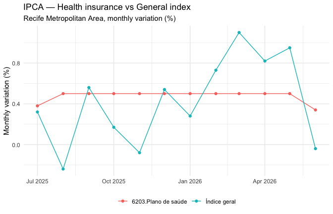

plot of chunk unnamed-chunk-6

------------------------------------------------------------------------

## 2) IPCA (7060) — Vehicle insurance

Same logic — only the category changes in classification `"315"`.

``` r

# Find category ID for "Seguro" (insurance)
unnest(meta_7060$classifications, categories) |>
  filter(str_detect(category_name, "Seguro|Índice")) |>
  select(id, category_id, category_name)
#> # A tibble: 2 × 3
#>   id    category_id category_name                       
#>   <chr> <chr>       <chr>                               
#> 1 315   7169        Índice geral                        
#> 2 315   7643        5102005.Seguro voluntário de veículo
```

``` r

ipca_vehicle_ins <- ibge_variables(
  aggregate = 7060,
  variable = 63,
  periods = -12,
  classification = list("315" = c("7169", "7643")),  # General + Vehicle insurance
  localities = "N7[2601]"
) |>
  mutate(
    value  = parse_ibge_value(value),
    period = period_to_monthly(period)
  ) |>
  select(period, classification_315, locality_name, value)
```

``` r

ipca_vehicle_ins |>
  ggplot(aes(period, value, color = classification_315)) +
  geom_line() +
  geom_point() +
  labs(
    title = "IPCA — Vehicle insurance vs General index",
    subtitle = "Recife Metropolitan Area, monthly variation (%)",
    x = NULL, y = "Monthly variation (%)", color = NULL
  ) +
  theme_minimal() +
  theme(legend.position = "bottom")
```

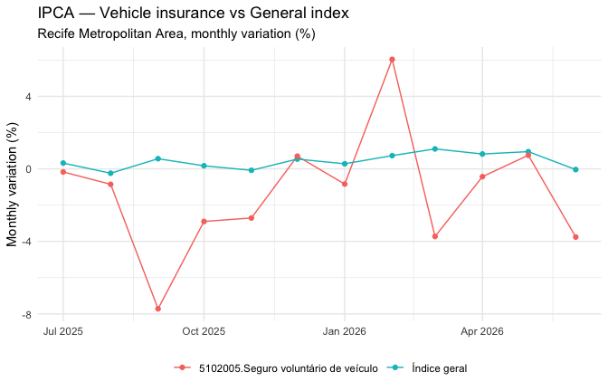

plot of chunk unnamed-chunk-9

------------------------------------------------------------------------

## 3) PMS (8693) — Transportation and postal services

The Monthly Survey of Services (PMS) aggregate 8693 is a proxy for
service-sector activity. Here we filter by:

- **Index type** (classification `11046`): revenue vs volume indices
- **Activity group** (classification `12355`): transportation, storage
  and postal services

``` r

meta_8693 <- ibge_metadata(8693)

# Browse classifications and categories
unnest(meta_8693$classifications, categories)
#> # A tibble: 8 × 6
#>   id    name              category_id category_name category_unit category_level
#>   <chr> <chr>             <chr>       <chr>         <chr>         <chr>         
#> 1 11046 Tipos de índice   56725       Índice de re… <NA>          0             
#> 2 11046 Tipos de índice   56726       Índice de vo… <NA>          0             
#> 3 12355 Atividades de se… 107071      Total         <NA>          0             
#> 4 12355 Atividades de se… 106869      1. Serviços … <NA>          1             
#> 5 12355 Atividades de se… 106874      2. Serviços … <NA>          1             
#> 6 12355 Atividades de se… 31399       3. Serviços … <NA>          1             
#> 7 12355 Atividades de se… 106876      4. Transport… <NA>          1             
#> 8 12355 Atividades de se… 31426       5. Outros se… <NA>          1
meta_8693$variables
#> # A tibble: 6 × 3
#>   id    name                                                               unit 
#>   <chr> <chr>                                                              <chr>
#> 1 7167  PMS - Número-índice (2022=100)                                     Núme…
#> 2 7168  PMS - Número-índice com ajuste sazonal (2022=100)                  Núme…
#> 3 11623 PMS - Variação mês/mês imediatamente anterior, com ajuste sazonal… %    
#> 4 11624 PMS - Variação mês/mesmo mês do ano anterior (M/M-12)              %    
#> 5 11625 PMS - Variação acumulada no ano (em relação ao mesmo período do a… %    
#> 6 11626 PMS - Variação acumulada em 12 meses (em relação ao período anter… %
```

``` r

pms_transport <- ibge_variables(
  aggregate = 8693,
  variable = 7167,                          # Index number (2022 = 100)
  periods = -12,
  classification = list(
    "11046" = "all",                        # All index types (revenue + volume)
    "12355" = "106876"                      # Transportation/postal services
  ),
  localities = "N3[26]"                     # Pernambuco
) |>
  mutate(
    value  = parse_ibge_value(value),
    period = period_to_monthly(period)
  ) |>
  select(period, classification_11046, locality_name, value)
```

``` r

pms_transport |>
  ggplot(aes(period, value, color = classification_11046)) +
  geom_line() +
  geom_point() +
  labs(
    title = "PMS — Index numbers (2022 = 100)",
    subtitle = "Transportation, storage and postal services (Pernambuco)",
    x = NULL, y = "Index (2022 = 100)", color = NULL
  ) +
  theme_minimal() +
  theme(legend.position = "bottom")
```

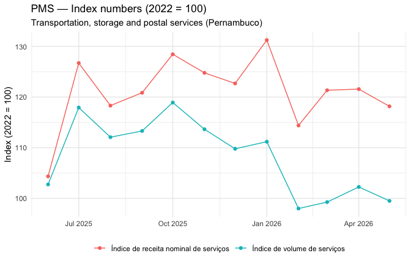

plot of chunk unnamed-chunk-12

------------------------------------------------------------------------

## 4) PNAD Contínua (5434) — Accommodation and food services

The Continuous PNAD aggregate 5434 provides quarterly employment data
(persons aged 14+ employed) by activity group.

``` r

meta_5434 <- ibge_metadata(5434)
unnest(meta_5434$classifications, categories)
#> # A tibble: 13 × 6
#>    id    name             category_id category_name category_unit category_level
#>    <chr> <chr>            <chr>       <chr>         <chr>         <chr>         
#>  1 888   Grupamento de a… 47946       Total         <NA>          0             
#>  2 888   Grupamento de a… 47947       Agricultura,… <NA>          1             
#>  3 888   Grupamento de a… 47948       Indústria ge… <NA>          1             
#>  4 888   Grupamento de a… 60031       Indústria de… <NA>          2             
#>  5 888   Grupamento de a… 47949       Construção    <NA>          1             
#>  6 888   Grupamento de a… 47950       Comércio, re… <NA>          1             
#>  7 888   Grupamento de a… 56622       Transporte, … <NA>          1             
#>  8 888   Grupamento de a… 56623       Alojamento e… <NA>          1             
#>  9 888   Grupamento de a… 56624       Informação, … <NA>          1             
#> 10 888   Grupamento de a… 60032       Administraçã… <NA>          1             
#> 11 888   Grupamento de a… 56627       Outros servi… <NA>          1             
#> 12 888   Grupamento de a… 56628       Serviços dom… <NA>          1             
#> 13 888   Grupamento de a… 60033       Atividades m… <NA>          1
meta_5434$variables
#> # A tibble: 4 × 3
#>   id    name                                                               unit 
#>   <chr> <chr>                                                              <chr>
#> 1 4090  Pessoas de 14 anos ou mais de idade ocupadas na semana de referên… Mil …
#> 2 4091  Coeficiente de variação - Pessoas de 14 anos ou mais de idade ocu… %    
#> 3 4108  Distribuição percentual das pessoas de 14 anos ou mais de idade o… %    
#> 4 4109  Coeficiente de variação - Distribuição percentual das pessoas de … %
```

``` r

pnad_accommodation <- ibge_variables(
  aggregate = 5434,
  variable = 4090,                          # Employed persons (thousands)
  periods = -12,                            # Last 12 quarters
  classification = list("888" = "56623"),   # Accommodation and food services
  localities = "N3[26]"                     # Pernambuco
) |>
  mutate(
    value  = parse_ibge_value(value),
    period = period_to_quarterly(period)
  ) |>
  select(period, classification_888, locality_name, value)
```

``` r

pnad_accommodation |>
  ggplot(aes(period, value)) +
  geom_line() +
  geom_point() +
  labs(
    title = "PNAD Contínua — Employed persons (14+)",
    subtitle = "Accommodation and food services (Pernambuco, thousands)",
    x = NULL, y = "Employed (thousands)"
  ) +
  theme_minimal()
```

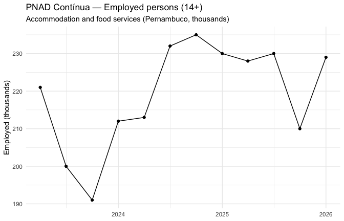

plot of chunk unnamed-chunk-15

------------------------------------------------------------------------

## 5) PMS (8693) — Professional and administrative services

Same aggregate as section 3, switching only the activity category in
classification `12355`:

``` r

pms_professional <- ibge_variables(
  aggregate = 8693,
  variable = 7167,
  periods = -12,
  classification = list(
    "11046" = "all",
    "12355" = "31399"                       # Professional/administrative services
  ),
  localities = "N3[26]"
) |>
  mutate(
    value  = parse_ibge_value(value),
    period = period_to_monthly(period)
  ) |>
  select(period, classification_11046, locality_name, value)
```

``` r

pms_professional |>
  ggplot(aes(period, value, color = classification_11046)) +
  geom_line() +
  geom_point() +
  labs(
    title = "PMS — Index numbers (2022 = 100)",
    subtitle = "Professional and administrative services (Pernambuco)",
    x = NULL, y = "Index (2022 = 100)", color = NULL
  ) +
  theme_minimal() +
  theme(legend.position = "bottom")
```

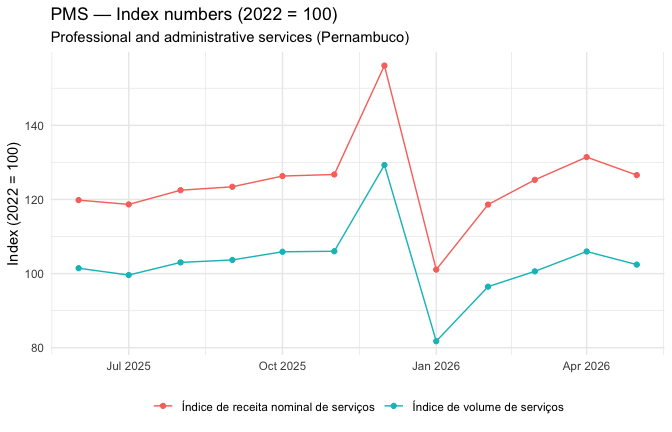

plot of chunk unnamed-chunk-17

------------------------------------------------------------------------

## 6) PNAD Contínua (5434) — Domestic services

``` r

pnad_domestic <- ibge_variables(
  aggregate = 5434,
  variable = 4090,
  periods = -12,
  classification = list("888" = "56628"),   # Domestic services
  localities = "N3[26]"
) |>
  mutate(
    value  = parse_ibge_value(value),
    period = period_to_quarterly(period)
  ) |>
  select(period, classification_888, locality_name, value)
```

``` r

pnad_domestic |>
  ggplot(aes(period, value)) +
  geom_line() +
  geom_point() +
  labs(
    title = "PNAD Contínua — Employed persons (14+)",
    subtitle = "Domestic services (Pernambuco, thousands)",
    x = NULL, y = "Employed (thousands)"
  ) +
  theme_minimal()
```

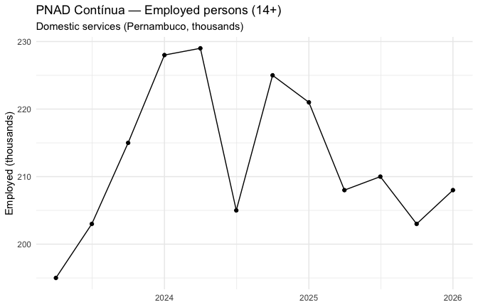

plot of chunk unnamed-chunk-19

------------------------------------------------------------------------

## 7) PIM-PF (8888) — Industrial production (selected CNAE sectors)

The PIM-PF (Monthly Industrial Survey — Physical Production) aggregate
8888 covers manufacturing output. Classification `544` filters by
industrial activity (CNAE sections).

``` r

meta_8888 <- ibge_metadata(8888)
unnest(meta_8888$classifications, categories)
#> # A tibble: 27 × 6
#>    id    name             category_id category_name category_unit category_level
#>    <chr> <chr>            <chr>       <chr>         <chr>         <chr>         
#>  1 544   Seções e ativid… 129314      1 Indústria … <NA>          0             
#>  2 544   Seções e ativid… 129315      2 Indústrias… <NA>          0             
#>  3 544   Seções e ativid… 129316      3 Indústrias… <NA>          0             
#>  4 544   Seções e ativid… 129317      3.10 Fabrica… <NA>          0             
#>  5 544   Seções e ativid… 129318      3.11 Fabrica… <NA>          0             
#>  6 544   Seções e ativid… 129319      3.12 Fabrica… <NA>          0             
#>  7 544   Seções e ativid… 129320      3.13 Fabrica… <NA>          0             
#>  8 544   Seções e ativid… 129321      3.14 Confecç… <NA>          0             
#>  9 544   Seções e ativid… 129322      3.15 Prepara… <NA>          0             
#> 10 544   Seções e ativid… 129323      3.16 Fabrica… <NA>          0             
#> # ℹ 17 more rows
meta_8888$variables
#> # A tibble: 6 × 3
#>   id    name                                                               unit 
#>   <chr> <chr>                                                              <chr>
#> 1 12606 PIMPF - Número-índice (2022=100)                                   Núme…
#> 2 12607 PIMPF - Número-índice com ajuste sazonal (2022=100)                Núme…
#> 3 11601 PIMPF - Variação mês/mês imediatamente anterior, com ajuste sazon… %    
#> 4 11602 PIMPF - Variação mês/mesmo mês do ano anterior (M/M-12)            %    
#> 5 11603 PIMPF - Variação acumulada no ano (em relação ao mesmo período do… %    
#> 6 11604 PIMPF - Variação acumulada em 12 meses (em relação ao período ant… %
```

``` r

pim_selected <- ibge_variables(
  aggregate = 8888,
  variable = 12606,                         # Index number (2022 = 100)
  periods = -12,
  classification = list(
    "544" = c(129318, 129338)               # Beverages; Motor vehicles
  ),
  localities = "N3[26]"
) |>
  mutate(
    value  = parse_ibge_value(value),
    period = period_to_monthly(period)
  ) |>
  select(period, classification_544, locality_name, value)
```

``` r

pim_selected |>
  ggplot(aes(period, value, color = classification_544)) +
  geom_line() +
  geom_point() +
  labs(
    title = "PIM-PF — Index numbers (2022 = 100)",
    subtitle = "Beverages and Motor vehicles (Pernambuco)",
    x = NULL, y = "Index (2022 = 100)", color = NULL
  ) +
  theme_minimal() +
  theme(legend.position = "bottom")
```

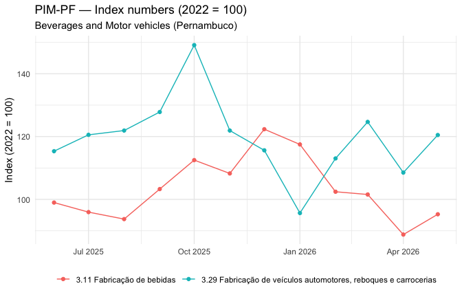

plot of chunk unnamed-chunk-22

------------------------------------------------------------------------

## 8) Construction (8886) — Typical construction inputs

``` r

meta_8886 <- ibge_metadata(8886)
meta_8886$variables
#> # A tibble: 4 × 3
#>   id    name                                                               unit 
#>   <chr> <chr>                                                              <chr>
#> 1 12606 PIMPF - Número-índice (2022=100)                                   Núme…
#> 2 11602 PIMPF - Variação mês/mesmo mês do ano anterior (M/M-12)            %    
#> 3 11603 PIMPF - Variação acumulada no ano (em relação ao mesmo período do… %    
#> 4 11604 PIMPF - Variação acumulada em 12 meses (em relação ao período ant… %
```

``` r

construction <- ibge_variables(
  aggregate = 8886,
  variable = 12606,                         # Index number (2022 = 100)
  periods = -12,
  localities = "N1"                         # Brazil
) |>
  mutate(
    value  = parse_ibge_value(value),
    period = period_to_monthly(period)
  ) |>
  select(period, locality_name, value)
```

``` r

construction |>
  ggplot(aes(period, value)) +
  geom_line() +
  geom_point() +
  labs(
    title = "Construction — Typical inputs (physical production)",
    subtitle = "Brazil, index number (2022 = 100)",
    x = NULL, y = "Index (2022 = 100)"
  ) +
  theme_minimal()
```

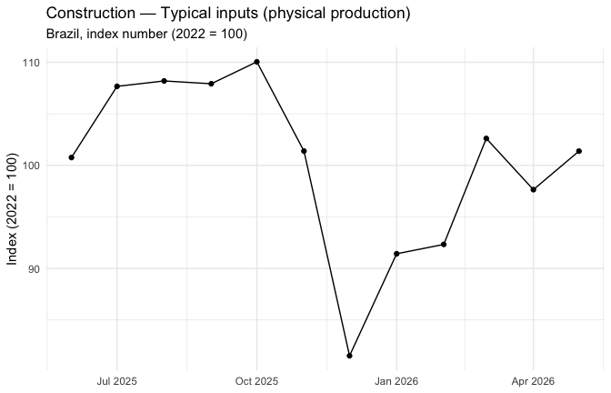

plot of chunk unnamed-chunk-25

------------------------------------------------------------------------

## 9) PMC (8884 / 8757 / 8880) — Retail trade indices

The Monthly Retail Trade Survey (PMC) publishes volume and revenue
indices across different retail segments. The three aggregates below
follow the same pattern — classification `11046` selects the index type
(volume vs nominal revenue).

### 9.1 Vehicles, motorcycles, parts and accessories (8884)

``` r

meta_8884 <- ibge_metadata(8884)
unnest(meta_8884$classifications, categories)
#> # A tibble: 2 × 6
#>   id    name            category_id category_name   category_unit category_level
#>   <chr> <chr>           <chr>       <chr>           <chr>         <chr>         
#> 1 11046 Tipos de índice 56737       Índice de rece… <NA>          0             
#> 2 11046 Tipos de índice 56738       Índice de volu… <NA>          0
meta_8884$variables
#> # A tibble: 6 × 3
#>   id    name                                                               unit 
#>   <chr> <chr>                                                              <chr>
#> 1 7169  PMC - Número-índice (2022=100)                                     Núme…
#> 2 7170  PMC - Número-índice com ajuste sazonal (2022=100)                  Núme…
#> 3 11708 PMC - Variação mês/mês imediatamente anterior, com ajuste sazonal… %    
#> 4 11709 PMC - Variação mês/mesmo mês do ano anterior (M/M-12)              %    
#> 5 11710 PMC - Variação acumulada no ano (em relação ao mesmo período do a… %    
#> 6 11711 PMC - Variação acumulada em 12 meses (em relação ao período anter… %
```

``` r

pmc_vehicles <- ibge_variables(
  aggregate = 8884,
  variable = 7169,                          # Index number (2022 = 100)
  periods = -12,
  classification = list("11046" = 56738),   # Volume index
  localities = "N3[26]"
) |>
  mutate(
    value  = parse_ibge_value(value),
    period = period_to_monthly(period)
  ) |>
  select(period, classification_11046, locality_name, value)
```

``` r

pmc_vehicles |>
  ggplot(aes(period, value)) +
  geom_line() +
  geom_point() +
  labs(
    title = "PMC — Sales volume index (2022 = 100)",
    subtitle = "Vehicles, motorcycles, parts and accessories (Pernambuco)",
    x = NULL, y = "Index (2022 = 100)"
  ) +
  theme_minimal()
```

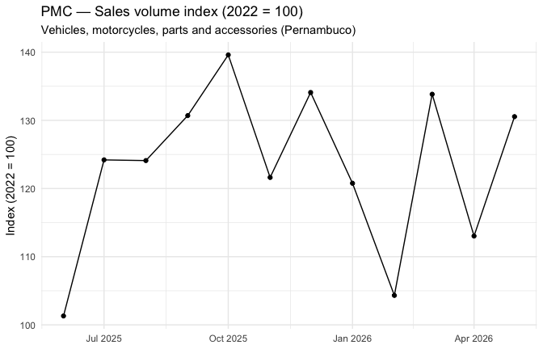

plot of chunk unnamed-chunk-28

### 9.2 Construction materials (8757)

``` r

pmc_construction <- ibge_variables(
  aggregate = 8757,
  variable = 7169,
  periods = -12,
  classification = list("11046" = 56732),   # Volume — construction materials
  localities = "N3[26]"
) |>
  mutate(
    value  = parse_ibge_value(value),
    period = period_to_monthly(period)
  ) |>
  select(period, classification_11046, locality_name, value)
```

``` r

pmc_construction |>
  ggplot(aes(period, value)) +
  geom_line() +
  geom_point() +
  labs(
    title = "PMC — Sales volume index (2022 = 100)",
    subtitle = "Construction materials (Pernambuco)",
    x = NULL, y = "Index (2022 = 100)"
  ) +
  theme_minimal()
```

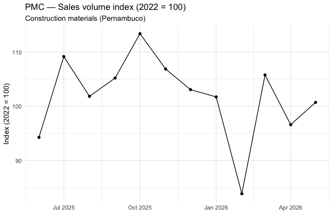

plot of chunk unnamed-chunk-30

### 9.3 Retail trade (8880)

``` r

pmc_retail <- ibge_variables(
  aggregate = 8880,
  variable = 7169,
  periods = -12,
  classification = list("11046" = 56734),   # Volume — retail trade
  localities = "N3[26]"
) |>
  mutate(
    value  = parse_ibge_value(value),
    period = period_to_monthly(period)
  ) |>
  select(period, classification_11046, locality_name, value)
```

``` r

pmc_retail |>
  ggplot(aes(period, value)) +
  geom_line() +
  geom_point() +
  labs(
    title = "PMC — Sales volume index (2022 = 100)",
    subtitle = "Retail trade (Pernambuco)",
    x = NULL, y = "Index (2022 = 100)"
  ) +
  theme_minimal()
```

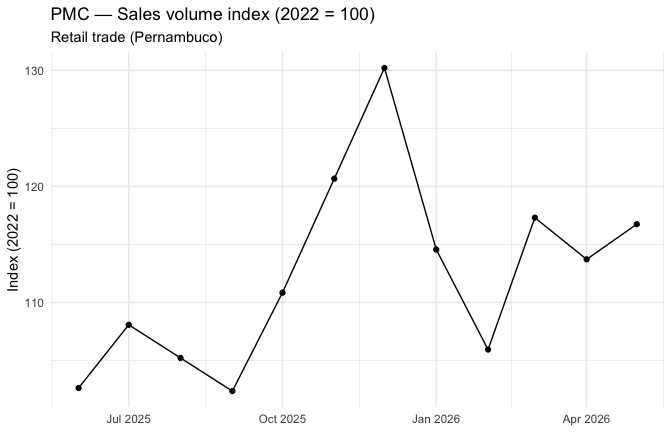

plot of chunk unnamed-chunk-32

------------------------------------------------------------------------

## Next steps

1.  **Save the series** in a standardised format
    (e.g. `arrow::write_parquet()` or a database) for reproducible
    dashboards.
2.  Build a **state GDP tracking dashboard** with normalisation (base
    100), smoothing (moving averages), and variation indicators
    (month-over-month, year-over-year).
3.  Wrap each block (IPCA, PMS, PNAD, PIM-PF, PMC) into a dedicated
    function to reduce repetition in production code.
