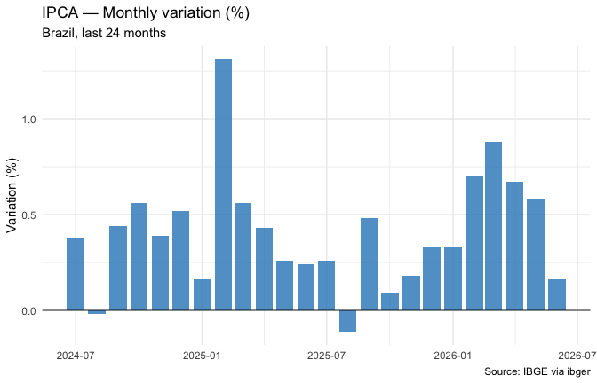
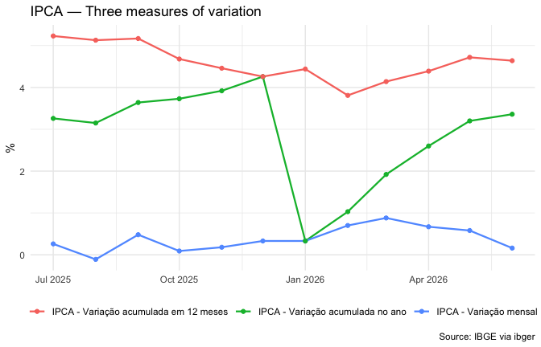
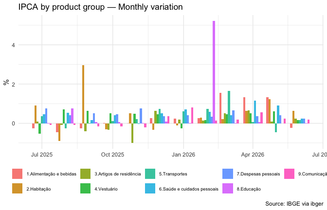
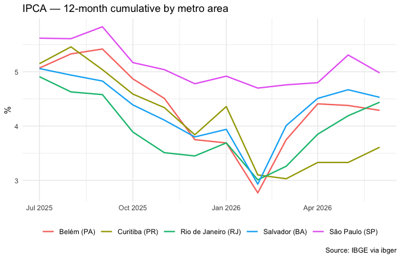

<!--
ipca-example.Rmd is generated from ipca-example.Rmd.orig by
vignettes/precompile.R, which runs the code against the live IBGE API.
Edit the .orig file, then re-run the script and commit the regenerated
.Rmd and figures.
-->


## Introduction

This vignette walks through a realistic analysis using ibger: downloading
IPCA (Índice Nacional de Preços ao Consumidor Amplo) inflation data and
preparing it for visualization and reporting.

IPCA is Brazil's official consumer price index, calculated monthly by IBGE.
The data is available through aggregate **7060**.

## Step 1 — Explore the aggregate


``` r
library(ibger)
library(dplyr)
library(tidyr)
library(ggplot2)

meta <- ibge_metadata(7060)
meta
```

Key information from the metadata:

- **Periodicity**: monthly, from 202001 onwards
- **Geographic levels**: N1 (Brazil), N6 (municipality), N7 (metropolitan area)
- **Variables**: monthly change (63), year-to-date (69), 12-month
  cumulative (2265), and monthly weight (66)
- **Classification 315**: product groups — 365 categories organized in a
  hierarchy from the general index down to individual items


``` r
# See what variables are available
meta$variables
#> # A tibble: 4 × 3
#>   id    name                                  unit 
#>   <chr> <chr>                                 <chr>
#> 1 63    IPCA - Variação mensal                %    
#> 2 69    IPCA - Variação acumulada no ano      %    
#> 3 2265  IPCA - Variação acumulada em 12 meses %    
#> 4 66    IPCA - Peso mensal                    %

# Peek at the classification categories
tidyr::unnest(meta$classifications, categories) |>
  head(20)
#> # A tibble: 20 × 6
#>    id    name             category_id category_name category_unit category_level
#>    <chr> <chr>            <chr>       <chr>         <chr>         <chr>         
#>  1 315   Geral, grupo, s… 7169        Índice geral  <NA>          0             
#>  2 315   Geral, grupo, s… 7170        1.Alimentaçã… <NA>          1             
#>  3 315   Geral, grupo, s… 7171        11.Alimentaç… <NA>          2             
#>  4 315   Geral, grupo, s… 7172        1101.Cereais… <NA>          3             
#>  5 315   Geral, grupo, s… 7173        1101002.Arroz <NA>          4             
#>  6 315   Geral, grupo, s… 7175        1101051.Feij… <NA>          4             
#>  7 315   Geral, grupo, s… 7176        1101052.Feij… <NA>          4             
#>  8 315   Geral, grupo, s… 47617       1101053.Feij… <NA>          4             
#>  9 315   Geral, grupo, s… 12222       1101073.Feij… <NA>          4             
#> 10 315   Geral, grupo, s… 47618       1101079.Milh… <NA>          4             
#> 11 315   Geral, grupo, s… 7184        1102.Farinha… <NA>          3             
#> 12 315   Geral, grupo, s… 7185        1102001.Fari… <NA>          4             
#> 13 315   Geral, grupo, s… 7187        1102006.Maca… <NA>          4             
#> 14 315   Geral, grupo, s… 7188        1102008.Fubá… <NA>          4             
#> 15 315   Geral, grupo, s… 7190        1102010.Floc… <NA>          4             
#> 16 315   Geral, grupo, s… 7191        1102012.Fari… <NA>          4             
#> 17 315   Geral, grupo, s… 7195        1102023.Fari… <NA>          4             
#> 18 315   Geral, grupo, s… 107608      1102029.Mass… <NA>          4             
#> 19 315   Geral, grupo, s… 47619       1102061.Maca… <NA>          4             
#> 20 315   Geral, grupo, s… 7200        1103.Tubércu… <NA>          3
```

## Step 2 — Monthly IPCA for Brazil

Let's get the monthly variation for the last 24 months:


``` r
ipca_br <- ibge_variables(
  aggregate  = 7060,
  variable   = 63,
  periods    = -24,
  localities = "BR"
)

ipca_br
#> # A tibble: 24 × 9
#>    variable_id variable_name        variable_unit classification_315 locality_id
#>    <chr>       <chr>                <chr>         <chr>              <chr>      
#>  1 63          IPCA - Variação men… %             Índice geral       1          
#>  2 63          IPCA - Variação men… %             Índice geral       1          
#>  3 63          IPCA - Variação men… %             Índice geral       1          
#>  4 63          IPCA - Variação men… %             Índice geral       1          
#>  5 63          IPCA - Variação men… %             Índice geral       1          
#>  6 63          IPCA - Variação men… %             Índice geral       1          
#>  7 63          IPCA - Variação men… %             Índice geral       1          
#>  8 63          IPCA - Variação men… %             Índice geral       1          
#>  9 63          IPCA - Variação men… %             Índice geral       1          
#> 10 63          IPCA - Variação men… %             Índice geral       1          
#> # ℹ 14 more rows
#> # ℹ 4 more variables: locality_name <chr>, locality_level <chr>, period <chr>,
#> #   value <chr>
```

The `value` column is character because of the API's special values
(see `?parse_ibge_value`). Use `parse_ibge_value()` to convert:


``` r
ipca_br <- ipca_br |>
  mutate(
    value = parse_ibge_value(value),
    date  = as.Date(paste0(period, "01"), format = "%Y%m%d")
  )
```

### Plot the monthly variation


``` r
ggplot(ipca_br, aes(date, value)) +
  geom_col(fill = "#2e86c1", alpha = 0.8) +
  geom_hline(yintercept = 0, linewidth = 0.3) +
  labs(
    title    = "IPCA — Monthly variation (%)",
    subtitle = "Brazil, last 24 months",
    x = NULL, y = "Variation (%)",
    caption  = "Source: IBGE via ibger"
  ) +
  theme_minimal()
```



## Step 3 — Compare accumulation measures

Get all three variation variables at once:


``` r
ipca_vars <- ibge_variables(
  aggregate  = 7060,
  variable   = c(63, 69, 2265),
  periods    = -12,
  localities = "BR"
)

ipca_vars <- ipca_vars |>
  mutate(
    value = parse_ibge_value(value),
    date  = as.Date(paste0(period, "01"), format = "%Y%m%d")
  )

ggplot(ipca_vars, aes(date, value, colour = variable_name)) +
  geom_line(linewidth = 0.8) +
  geom_point(size = 1.5) +
  labs(
    title  = "IPCA — Three measures of variation",
    x = NULL, y = "%", colour = NULL,
    caption = "Source: IBGE via ibger"
  ) +
  theme_minimal() +
  theme(legend.position = "bottom")
```



## Step 4 — Breakdown by product group

Classification 315 organizes IPCA items hierarchically. The top-level
groups (level 1 categories) are things like Food and beverages (7170),
Housing (7445), Transportation (7486), etc.

First, find the category IDs you need:


``` r
cats <- tidyr::unnest(meta$classifications, categories)

# Level-1 groups (just below the general index)
cats |> filter(category_level == "1")
#> # A tibble: 9 × 6
#>   id    name              category_id category_name category_unit category_level
#>   <chr> <chr>             <chr>       <chr>         <chr>         <chr>         
#> 1 315   Geral, grupo, su… 7170        1.Alimentaçã… <NA>          1             
#> 2 315   Geral, grupo, su… 7445        2.Habitação   <NA>          1             
#> 3 315   Geral, grupo, su… 7486        3.Artigos de… <NA>          1             
#> 4 315   Geral, grupo, su… 7558        4.Vestuário   <NA>          1             
#> 5 315   Geral, grupo, su… 7625        5.Transportes <NA>          1             
#> 6 315   Geral, grupo, su… 7660        6.Saúde e cu… <NA>          1             
#> 7 315   Geral, grupo, su… 7712        7.Despesas p… <NA>          1             
#> 8 315   Geral, grupo, su… 7766        8.Educação    <NA>          1             
#> 9 315   Geral, grupo, su… 7786        9.Comunicação <NA>          1
```

Now query specific groups:


``` r
groups <- ibge_variables(
  aggregate      = 7060,
  variable       = 63,
  periods        = -12,
  localities     = "BR",
  classification = list("315" = c(7170, 7445, 7486, 7558, 7625, 7660, 7712, 7766, 7786))
)

groups <- groups |>
  mutate(
    value = parse_ibge_value(value),
    date  = as.Date(paste0(period, "01"), format = "%Y%m%d")
  )

ggplot(groups, aes(date, value, fill = classification_315)) +
  geom_col(position = "dodge", alpha = 0.85) +
  labs(
    title = "IPCA by product group — Monthly variation",
    x = NULL, y = "%", fill = NULL,
    caption = "Source: IBGE via ibger"
  ) +
  theme_minimal() +
  theme(legend.position = "bottom", legend.text = element_text(size = 7))
```



## Step 5 — Metropolitan area comparison

Aggregate 7060 is available at level N7 (metropolitan areas). Compare
inflation across major cities:


``` r
# Check available metropolitan areas
metros <- ibge_localities(7060, level = "N7")
metros
#> # A tibble: 0 × 0
```

Pick a few and compare:


``` r
ipca_metros <- ibge_variables(
  aggregate  = 7060,
  variable   = 2265,
  periods    = -12,
  localities = list(N7 = c(3501, 3301, 2901, 4101, 1501))
)

ipca_metros <- ipca_metros |>
  mutate(
    value = parse_ibge_value(value),
    date  = as.Date(paste0(period, "01"), format = "%Y%m%d")
  )

ggplot(ipca_metros, aes(date, value, colour = locality_name)) +
  geom_line(linewidth = 0.8) +
  labs(
    title   = "IPCA — 12-month cumulative by metro area",
    x = NULL, y = "%", colour = NULL,
    caption = "Source: IBGE via ibger"
  ) +
  theme_minimal() +
  theme(legend.position = "bottom")
```



## Step 6 — Building a complete dataset

For a more complete analysis, combine multiple queries. For instance,
download the general index for all metro areas and reshape:


``` r
all_metros <- ibge_variables(
  aggregate      = 7060,
  variable       = c(63, 69, 2265),
  periods        = -12,
  localities     = "N7",
  classification = list("315" = 7169)
)

all_metros <- all_metros |>
  mutate(value = parse_ibge_value(value)) |>
  select(variable_name, locality_name, period, value) |>
  pivot_wider(names_from = variable_name, values_from = value)

all_metros
#> # A tibble: 120 × 5
#>    locality_name period `IPCA - Variação mensal` IPCA - Variação acumulada no …¹
#>    <chr>         <chr>                     <dbl>                           <dbl>
#>  1 Belém - PA    202507                    -0.04                            3.35
#>  2 Belém - PA    202508                    -0.15                            3.19
#>  3 Belém - PA    202509                     0.27                            3.47
#>  4 Belém - PA    202510                     0.26                            3.74
#>  5 Belém - PA    202511                     0.11                            3.85
#>  6 Belém - PA    202512                    -0.1                             3.75
#>  7 Belém - PA    202601                     0.16                            0.16
#>  8 Belém - PA    202602                     0.62                            0.78
#>  9 Belém - PA    202603                     1.31                            2.11
#> 10 Belém - PA    202604                     1.08                            3.21
#> # ℹ 110 more rows
#> # ℹ abbreviated name: ¹​`IPCA - Variação acumulada no ano`
#> # ℹ 1 more variable: `IPCA - Variação acumulada em 12 meses` <dbl>
```

## Tips for large queries

IPCA has 365 categories in classification 315. Querying all categories
for all periods and all metro areas can easily exceed the 100,000-value
limit. Strategies:

1. **Reduce periods**: use `-1` or `-3` instead of `-12`
2. **Reduce localities**: query one metro at a time
3. **Reduce categories**: pick only the groups you need
4. **Loop and bind**: query in chunks and combine with `dplyr::bind_rows()`


``` r
# Example: query all categories for just 1 period, Brazil only
full_breakdown <- ibge_variables(
  aggregate      = 7060,
  variable       = 63,
  periods        = -1,
  localities     = "BR",
  classification = list("315" = "all")
)

nrow(full_breakdown)
#> [1] 457
```

## Handling special values

The `value` column returned by `ibge_variables()` is always character,
because the IBGE API uses special codes for certain data conditions.
Use `parse_ibge_value()` to convert to numeric in one step:


``` r
ibge_variables(7060, localities = "BR") |>
  mutate(value = parse_ibge_value(value))
#> # A tibble: 24 × 9
#>    variable_id variable_name        variable_unit classification_315 locality_id
#>    <chr>       <chr>                <chr>         <chr>              <chr>      
#>  1 63          IPCA - Variação men… %             Índice geral       1          
#>  2 63          IPCA - Variação men… %             Índice geral       1          
#>  3 63          IPCA - Variação men… %             Índice geral       1          
#>  4 63          IPCA - Variação men… %             Índice geral       1          
#>  5 63          IPCA - Variação men… %             Índice geral       1          
#>  6 63          IPCA - Variação men… %             Índice geral       1          
#>  7 69          IPCA - Variação acu… %             Índice geral       1          
#>  8 69          IPCA - Variação acu… %             Índice geral       1          
#>  9 69          IPCA - Variação acu… %             Índice geral       1          
#> 10 69          IPCA - Variação acu… %             Índice geral       1          
#> # ℹ 14 more rows
#> # ℹ 4 more variables: locality_name <chr>, locality_level <chr>, period <chr>,
#> #   value <dbl>
```

The function handles all IBGE conventions — `"-"` becomes `0` and the
"not available" codes become `NA`. See `?parse_ibge_value` for the full
table of codes and their meanings.


``` r
parse_ibge_value(c("1.5", "10", "-", "..", "...", "X"))
#> [1]  1.5 10.0  0.0   NA   NA   NA
```
